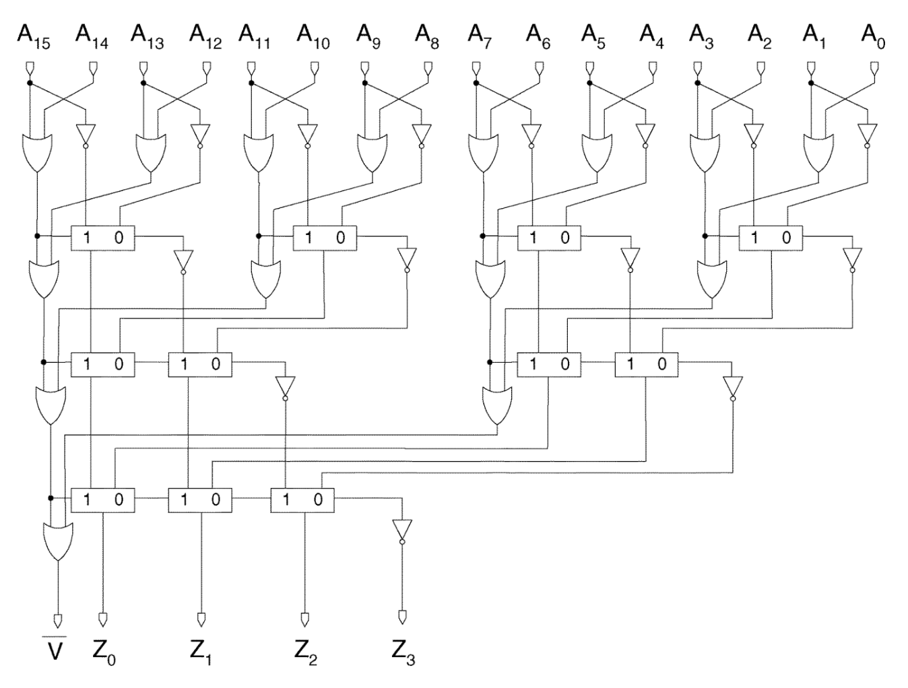
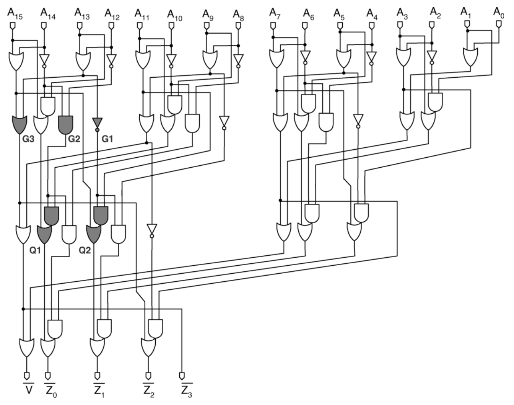
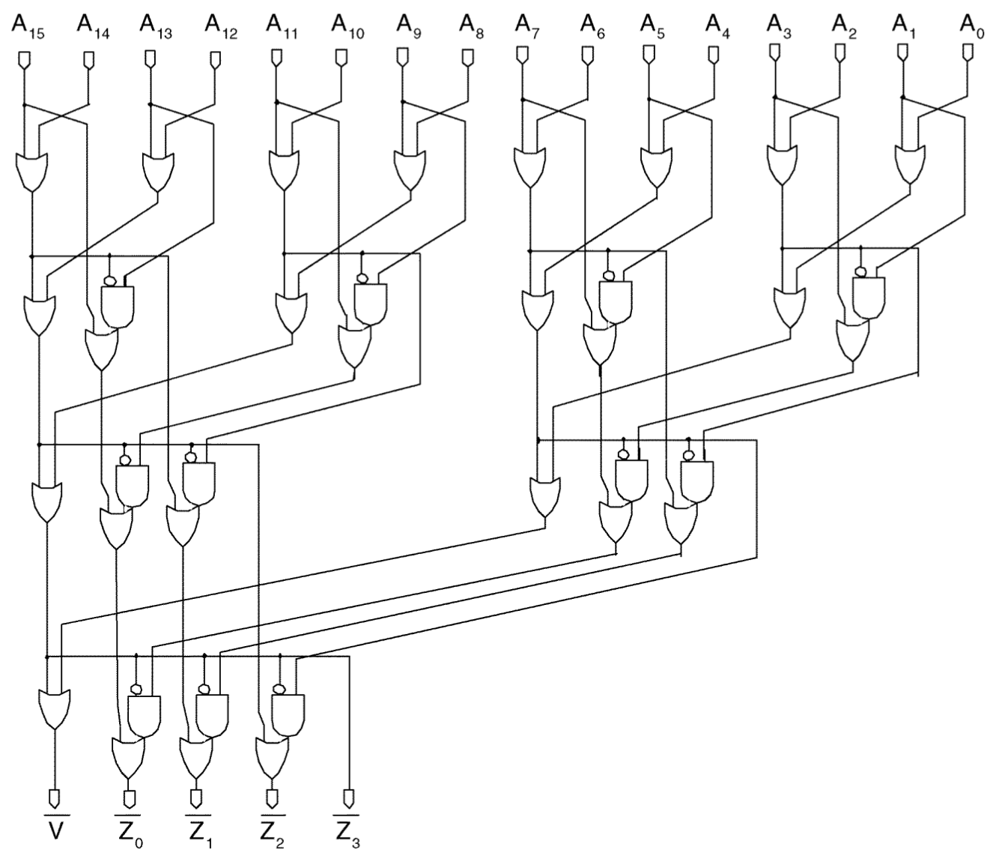

# Leading-Zero Counting

Три реализации счетчика ведущих нулей для блоков FPU. Одна из основных операций в тракте данных блоков с плавающей точкой является нормализация. При нормализации результат операции с плавающей точкой приводится к нормализованной форме, т.е. 1.xxx..x, где x ∈ {0, 1}. Для определения величины сдвига, для получения нормализованной формы, используется блок подсчета ведущих (старших) нулей (ZLC). 

Три блока реализуют три подхода к реализации. **Classic** - предложен в статье V. Oklobdzija, “An algorithmic and novel design of a leading zero detector circuit: Comparison with logic synthesis”. **Proposed** и **Second** - предлагается авторами статьи Low-Power Leading-Zero Counting and Anticipation Logic for High-Speed Floating Point Units // Giorgos Dimitrakopoulos, Kostas Galanopoulos, Christos Mavrokefalidis, Dimitris Nikolos.

У блоков подсчета ведущих нулей только один параметр - разрядность входа (WIDTH), который по-умолчанию установлен на 16 бит и может быть любой степенью двойки - {2, 4, 8, 16, ..}

*Classic algorithm*

*Proposed algorithm*

*Second algorithm*

